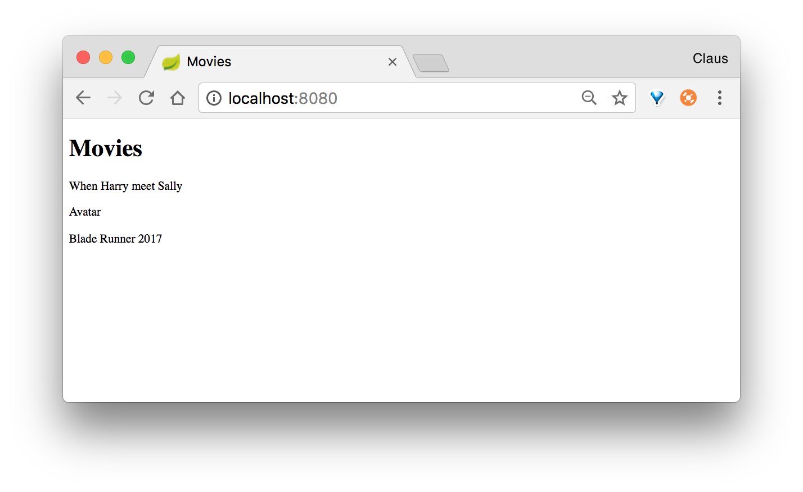

# #1 Exercise: Create a Spring Boot application

1. Create a new Spring Boot Application in IntelliJ
2. in that create a MoviesController
3. in that declare a method that can return an index.html page that shows the titles of 3 movies

The result should be that you in the browser will be able to see something like this:

    

## Create a new route

1. Create the functionallity that makes your application able to show an actors page with the names of 3 actors

_
&copy; clbo@kea.dk
_
